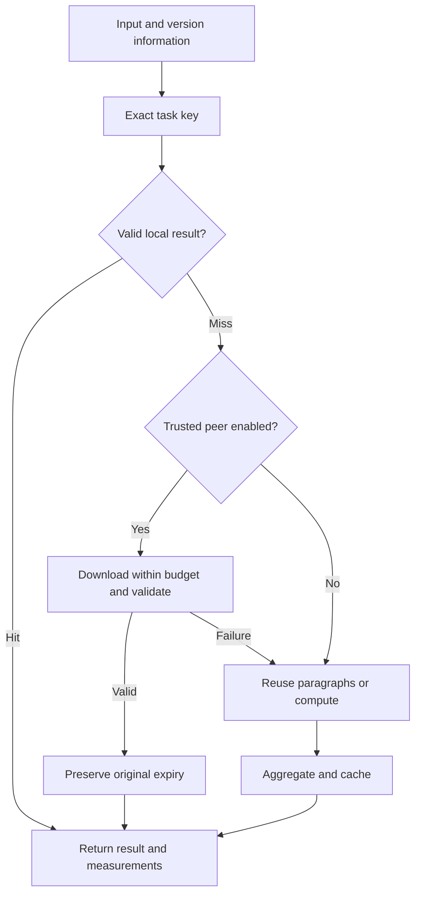

# FlowCache Harness

**Transfer completed computation results to avoid repeating the work.** A runnable demo with no external model calls and no third-party runtime dependencies.

To continue testing in local Codex, start with [CODEX_LOCAL_TEST.md](CODEX_LOCAL_TEST.md). The standard demo does not call a model; `experiments/model_ab/run.py --run` is a separate, explicitly enabled API experiment. The archived API A/B attempt has not been executed. The regression suite contains 36 tests.

The network transfers results already computed on another machine, which this machine validates and reuses. Initial computation still requires real CPU work. The standard demo does not connect to ChatGPT or change a ChatGPT subscription's usage limits.

## Start in 30 seconds

Local search without model calls is also available:
`python3 -m flowcache search "cache expiry" --root ./flowcache --max-chars 2400`.
Code search requires no network access. Explicitly requested documents are downloaded and cached by the device running the program. Retrieved snippets still consume input tokens when a model reads them. See the [local search guide](docs/LOCAL_SEARCH.md).

Requires Python 3.11 or later. From the project directory, run:

```bash
python3 -m flowcache demo
```

Open **http://127.0.0.1:8080**. On Windows, use `python` instead of `python3`, or double-click `run-demo.bat`. On macOS or Linux, you can run `bash run-demo.sh`. No API key, package installation, or account is required.

Try the controls in this order:

1. **First run**: generate fingerprints for 6 paragraphs and 1 aggregate result from an empty cache.
2. **Run again**: reuse the exact document result; the number of computed nodes should be 0.
3. **Edit last paragraph**: append text to the final paragraph; reuse the other 5 paragraphs and recompute the changed paragraph and aggregate.
4. **Reuse over network**: generate results in an independent source cache, then download them over real HTTP. Preparation costs are reported separately.
5. **Run full comparison**: compare measured CPU time, elapsed time, and downloaded bytes across scenarios, then download the JSON report.

You can also edit a number or negation in the input and select **Run again**. Changed content will not incorrectly reuse the previous exact result. **Edit last paragraph** and **Change task version** first prepare the original version, then measure the target version. Repeated clicks may reuse results already produced by earlier runs.

## Implemented features

| Feature | Behavior |
| --- | --- |
| Exact result cache | SHA-256 keys, persistent SQLite storage, manual clearing |
| Paragraph DAG reuse | Independent paragraph computation; the aggregate depends on ordered child keys |
| Invalidation | Content, workspace, task version, code version, parameters, permission revision, and TTL |
| Remote reuse | Bearer authentication, HMAC signatures, checksums, and input-to-result binding validation |
| Conservative fallback | Compute locally after a miss, timeout, invalid signature, expiry, or insufficient download budget |
| Request limits | At most 8 peer requests per task; stop remote requests after the first transport error |
| Measurements | Client CPU, computation CPU, wall-clock time, response-body bytes read, and node sources |
| Comparison scenarios | No cache, cold local cache, warm local cache, warm remote cache, and recomputation after editing |
| Local interface | English dashboard, node traces, raw JSON, and comparison report export |

Computation is local by default. Network access is used only with `run --peer` or **Reuse over network** in the dashboard. Dashboard network tests use the local loopback interface.

## What does the computation do?

For each paragraph, the program computes a character 5-gram MinHash fingerprint, character count, extracted numbers, and simple negation matches. MinHash can compare the lexical similarity of text fragments, but this project **does not reuse answers based on similarity** or determine meaning or factual correctness.

The workload performs real BLAKE2b fingerprint calculations. It does not use `sleep`, fabricated timings, or randomly generated savings. This is a Python reference implementation, not an optimized text-processing engine. Its measured benefits cannot be extrapolated to all production workloads, GPU inference, or large-model costs.

Blank lines separate paragraphs. Only CRLF line endings are normalized; the program does not paraphrase text or remove numbers or negations. Changes to task computation code require an updated `EXECUTOR_VERSION`. Unknown, mismatched, or untrusted results are cache misses.

## Architecture



The document result is checked first. Paragraphs are accessed only after a document-level miss. Editing one paragraph leaves the other paragraph keys unchanged; reordering paragraphs recomputes only the aggregate. The aggregate expires no later than any child node, and downloading a remote result never extends its lifetime.

## Command line

```bash
# Uncached baseline: neither read nor populate the cache
python3 -m flowcache run --baseline

# Run the same file twice and observe the second-run hit
python3 -m flowcache run --input examples/document.txt
python3 -m flowcache run --input examples/document.txt

# Change task version or workspace to prevent reuse under the old identity
python3 -m flowcache run --input examples/document.txt --version v2
python3 -m flowcache run --input examples/document.txt --workspace project-b

# Seven repetitions, with individual measurements saved as JSON
python3 -m flowcache benchmark --repetitions 7 --output benchmark.json

# Check correctness and fallback behavior
python3 -m unittest discover -s tests -v
```

`run` supports `--ttl`, `--acl-revision`, `--permutations`, `--download-budget`, `--timeout`, and `--output`. Defaults are a 3,600-second TTL, a 256 KiB download budget, a 1-second timeout per network operation, and 128 fingerprint dimensions.

## Reuse between two machines over WiFi

The dashboard and built-in benchmark use **independent caches on one machine with real HTTP loopback transfers**. They are not measurements between two physical devices over WiFi. To use the same protocol between two trusted devices with Python, follow these steps.

In the project directory on source device A:

```bash
python3 -m flowcache run --input examples/document.txt --cache .flowcache/source.sqlite3
export FLOWCACHE_PEER_TOKEN="$(python3 -c 'import secrets; print(secrets.token_urlsafe(32))')"
python3 -m flowcache peer --cache .flowcache/source.sqlite3 --port 8090
```

Configure the same random `FLOWCACHE_PEER_TOKEN` securely on both devices. Do not place it in source code, URLs, or commits. The environment-variable syntax above is for macOS and Linux.

On receiving device B, establish an SSH tunnel. Replace the username and LAN address with those of device A, which you must be authorized to access:

```bash
ssh -N -L 8091:127.0.0.1:8090 your-user@device-a-address
```

Keep the tunnel running. In another terminal on B, set the same token and run:

```bash
python3 -m flowcache run --input examples/document.txt \
  --cache .flowcache/receiver.sqlite3 \
  --peer http://127.0.0.1:8091 \
  --download-budget 262144
```

Input, versions, parameters, and workspace must match A. On its first run, B downloads the result. Subsequent runs normally use B's local cache. Use a new receiver cache path to measure another network transfer. CLI output measures only B's client CPU; measure A's resources separately rather than treating them as zero.

The built-in peer binds only to loopback and rejects remote plaintext HTTP. The SSH tunnel carries the actual WiFi transfer. Alternatively, a managed HTTPS endpoint can forward to the local peer. Token holders share a trust domain and can access that node's cache; workspace keys and `acl_revision` **are not a multi-tenant authorization system**. This demo is not a public cloud cache service.

## Interpreting savings

Raw historical measurements are in [`examples/benchmark.local.json`](examples/benchmark.local.json), with a summary in [`examples/RESULTS.md`](examples/RESULTS.md). These are observations from the original execution environment, not performance guarantees. They used the original sample; the English sample introduced later is a different workload.

```text
CPU reduction for a repeated request = 1 - reuse CPU / uncached CPU for the same input
Net CPU benefit of N remote reuses ≈ N × (uncached CPU - remote-reuse CPU) - source priming CPU
```

The benchmark's `cohost_process_cpu_ms` includes the client and HTTP server threads in the same process during each request. `client_cpu_ms` measures only the calling thread; do not add the two. `compute_cpu_ms` covers the actual work functions, excluding caching and scheduling. Network measurements count **HTTP response-body bytes actually read by the application**, excluding HTTP headers, TCP/TLS, retransmissions, and SSH overhead. They are not network-interface counters.

Cold fills, source priming, and warm-cache reuse are reported separately. Process startup, table creation, SSH setup, idle storage, electricity, and hardware depreciation are excluded. The edited-last-paragraph scenario has different input, so its savings are not compared directly with the original-input baseline. Negative savings are displayed as measured, not clamped to zero.

There is no fixed conversion rate from 1 GB of data to computing power. Repetition rate, task cost, artifact size, validation overhead, and network conditions all affect the outcome. Once a local cache hit is available, additional network traffic usually provides no benefit.

## Project structure and next steps

```text
flowcache/core.py       Exact identities, persistent cache, document DAG, measurements
flowcache/peer.py       Bounded HTTP downloads and trusted peer service
flowcache/demo.py       Reproducible comparison scenarios
flowcache/web.py        Local dashboard API
flowcache/static/       Framework-free frontend
tests/test_harness.py   Correctness, invalidation, isolation, network fallback, and endpoint tests
.github/workflows/     Python 3.11 / 3.12 / 3.13 CI
```

The project currently implements the core computation-reuse path. It does not yet provide a generic task plugin interface, local LLM or cloud-model adapters for that path, predictive cost routing, distributed execution, multi-tenant permissions, GPU telemetry, KV-cache migration, device discovery, or remote invalidation notifications. Future model integrations must independently validate output quality, model versions, tool state, user permissions, and actual costs.

Documentation, dashboard text, and the default sample are in English. Multilingual test data and immutable historical experiment evidence retain their original contents; see [language and evidence preservation](docs/LANGUAGE.md).
