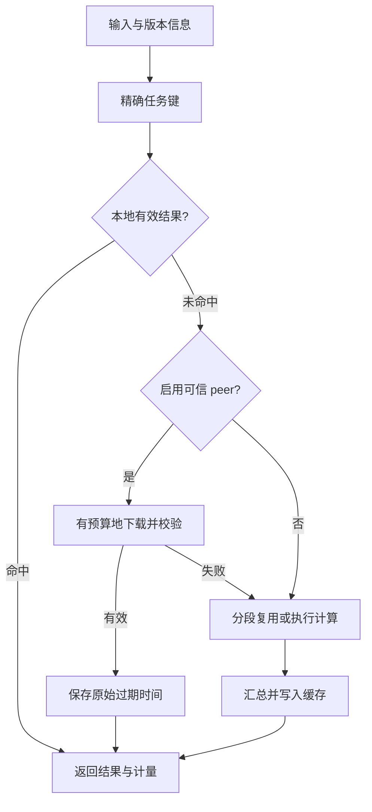

# FlowCache Harness

**把已完成的计算结果传过来，减少重复计算。** 一个零外部模型调用、零运行时第三方依赖的可运行 demo。

在本地 Codex 接着测试请先读 [CODEX_LOCAL_TEST.md](CODEX_LOCAL_TEST.md)。常规 demo 不调用模型；`experiments/model_ab/run.py --run` 是单独、显式启用的 API 实验入口。真实模型 A/B 尚未执行，当前回归共 36 项通过。

它不是把 WiFi 流量变成 GPU 算力。网络负责传输另一台机器已经算好的结果；本机验证后复用。首次计算仍然需要真实 CPU。本项目不接入 ChatGPT，不改变 ChatGPT 订阅额度。

## 30 秒启动

新增：本地无模型搜索，运行 `python3 -m flowcache search "cache expiry" --root ./flowcache --max-chars 2400`。代码搜索零网络，指定文档由运行设备下载并缓存；返回模型的片段仍占输入 token。详见 [本地搜索说明](docs/LOCAL_SEARCH.md)。

需要 Python 3.11 或更高版本。在项目目录运行：

```bash
python3 -m flowcache demo
```

打开 **http://127.0.0.1:8080**。Windows 可用 `python` 代替 `python3`，或双击 `run-demo.bat`；macOS / Linux 可运行 `bash run-demo.sh`。无需 API key、pip install 或账号。

建议依次点击：

1. **首次计算**：从空缓存生成 6 个段落指纹及 1 个汇总结果。
2. **重复运行**：整份文档精确命中，本次计算节点应为 0。
3. **修改末段**：在末段追加文字；5 个未变段落复用，末段与汇总重算。
4. **通过网络复用**：独立源缓存生成结果，再通过真实 HTTP 下载；准备成本单列。
5. **运行完整对照**：比较各场景的实测 CPU、时间和流量，下载 JSON。

也可以直接修改输入数字或否定词后点「重复运行」。新内容不会误用原有精确结果。「修改末段」「切换任务版本」会先准备原始版本，再测量目标版本；重复点击可能进一步命中已产生的缓存。

## 已实现

| 功能 | 行为 |
| --- | --- |
| 精确结果缓存 | SHA-256 键，SQLite 持久保存，可手动清空 |
| 分段 DAG 复用 | 段落独立计算，汇总依赖有序子节点键 |
| 失效 | 内容、工作区、任务版本、代码版本、参数、权限修订号、TTL |
| 远端复用 | Bearer 认证 + HMAC 签名 + 校验和 + 输入与结果绑定校验 |
| 保守回退 | 未命中、超时、签名失败、过期、流量预算不足时本机重算 |
| 请求限制 | 每次任务最多 8 次 peer 请求，首次传输错误后停止远端请求 |
| 计量 | 客户端 CPU、计算函数 CPU、墙钟时间、已读取响应体字节、节点来源 |
| 对照实验 | 无缓存、首次填充、本地热缓存、远端热缓存、编辑后重算 |
| 本地界面 | 中文面板、节点轨迹、原始 JSON、对照报告导出 |

默认只执行本地计算。使用 `run --peer` 或在面板点击「通过网络复用」才使用网络；面板的网络测试也仅访问本机环回地址。

## 计算任务是什么

每个段落计算字符 5-gram 的 MinHash 指纹，以及字符数、数字和简单否定词匹配。MinHash 可用来比较文字片段相似度，但本项目**不按相似度复用答案**，也不判断句子含义或事实真假。

工作量来自实际 BLAKE2b 指纹计算，没有 `sleep`、伪造耗时或随机生成的节省比例。这是 Python 参考实现，不是优化后的文本处理引擎；测出的收益不能外推到所有生产任务、GPU 推理或大模型费用。

空行划分段落，只统一 CRLF 换行；不做语义改写、去数字或去否定词。任务代码发生变化时必须更新 `EXECUTOR_VERSION`。未知、不同或不可信的结果不命中缓存。

## 架构



先查询整份文档结果；未命中才访问各段落。修改一个段落时，其他段落键保持稳定；调整顺序只重算汇总。汇总有效期不晚于任一子节点的有效期，远端下载不会延长有效期。

## 命令行

```bash
# 无缓存基线；不读取或填充缓存
python3 -m flowcache run --baseline

# 同一份文件运行两次，观察第二次命中
python3 -m flowcache run --input examples/document.txt
python3 -m flowcache run --input examples/document.txt

# 更换任务版本或工作区，不复用旧身份的结果
python3 -m flowcache run --input examples/document.txt --version v2
python3 -m flowcache run --input examples/document.txt --workspace project-b

# 7 次对照实验，输出包含各次原始计量的 JSON
python3 -m flowcache benchmark --repetitions 7 --output benchmark.json

# 验证正确性和回退行为
python3 -m unittest discover -s tests -v
```

`run` 支持 `--ttl`、`--acl-revision`、`--permutations`、`--download-budget`、`--timeout`、`--output`。默认 TTL 3600 秒，下载预算 256 KiB，单次网络操作超时 1 秒，指纹维度 128。

## 两台机器通过 WiFi 复用

面板和内置 benchmark 使用**同一台机器上的独立缓存与真实 HTTP 环回传输**，并不是两台物理设备的 WiFi 实测。可以按下面步骤把同一套协议运行到两台拥有 Python 的可信设备上。

在源设备 A 的项目目录：

```bash
python3 -m flowcache run --input examples/document.txt --cache .flowcache/source.sqlite3
export FLOWCACHE_PEER_TOKEN="$(python3 -c 'import secrets; print(secrets.token_urlsafe(32))')"
python3 -m flowcache peer --cache .flowcache/source.sqlite3 --port 8090
```

双方需要通过安全方式配置同一随机 `FLOWCACHE_PEER_TOKEN`。不要把密钥写入代码、URL 或提交到仓库。示例环境变量语法适用于 macOS / Linux。

在接收设备 B 建立 SSH 隧道；替换成你有权登录的设备 A 的用户名与局域网地址：

```bash
ssh -N -L 8091:127.0.0.1:8090 your-user@device-a-address
```

保持隧道运行，在 B 的另一个终端设置同一密钥，再执行：

```bash
python3 -m flowcache run --input examples/document.txt \
  --cache .flowcache/receiver.sqlite3 \
  --peer http://127.0.0.1:8091 \
  --download-budget 262144
```

输入、版本、参数和工作区必须与 A 相同。首轮 B 下载结果，再次运行默认直接命中 B 的本地缓存。若要再次单测网络，可换一个新的接收缓存路径。CLI 输出仅测 B 的客户端 CPU；A 的资源需要在 A 上另外测量，不能当作零。

内置 peer 只绑定本机，远程明文 HTTP 被拒绝；SSH 隧道承担真实 WiFi 传输。也可以由你管理的 HTTPS 入口转发到本机 peer。密钥持有者属于同一信任域，能够访问该节点的缓存；工作区键和 `acl_revision` **不是多租户授权系统**。不要把这个 demo 直接当成公共云缓存服务。

## 怎样解读节省量

原始报告见 [`examples/benchmark.local.json`](examples/benchmark.local.json)，简表见 [`examples/RESULTS.md`](examples/RESULTS.md)。这些是本次执行机器上的测量样本，不是性能承诺。

```text
重复请求 CPU 减少比例 = 1 - 复用场景 CPU / 同输入无缓存 CPU
N 次远端复用的 CPU 净收益 ≈ N × (无缓存 CPU - 远端复用 CPU) - 源端首次生成 CPU
```

benchmark 的 `cohost_process_cpu_ms` 包含该请求期间同一进程的客户端与 HTTP 服务线程。`client_cpu_ms` 只统计调用线程；两者不能再相加。`compute_cpu_ms` 只包含实际工作函数，不包含缓存与调度成本。流量字段统计**应用实际读取的 HTTP 响应体字节**，不含 HTTP 头、TCP/TLS、重传或 SSH 开销，也不表示网卡计数器。

首次填充、源端生成、热缓存复用分别报告。进程启动、建表、SSH 建连、闲置存储、电费和硬件折旧未计入。修改末段后的输入不同，报告不拿它直接计算相对原文基线的节省百分比。负收益原样显示，不截断成 0。

没有固定的「1 GB = 多少算力」兑换率：重复率、任务成本、产物大小、验证开销和网络条件都改变结果。本地缓存已经命中时，再消耗网络流量通常没有收益。

## 项目结构与下一步

```text
flowcache/core.py       精确身份、持久缓存、文档 DAG、计量
flowcache/peer.py       有预算的 HTTP 下载与可信 peer 服务
flowcache/demo.py       可重复对照实验
flowcache/web.py        本地面板 API
flowcache/static/       无框架前端
tests/test_harness.py   正确性、失效、隔离、网络回退与端点测试
.github/workflows/     Python 3.11 / 3.12 / 3.13 CI
```

当前只实现计划中的计算复用主链路。尚未实现：通用任务插件接口、本地 LLM 或云端模型适配器、预测式成本路由、分布式执行、多租户权限、GPU 遥测、KV cache 迁移、跨设备发现和远端自动失效通知。未来接入模型时，仍需分别验证输出质量、模型版本、工具状态、用户权限及真实费用。
